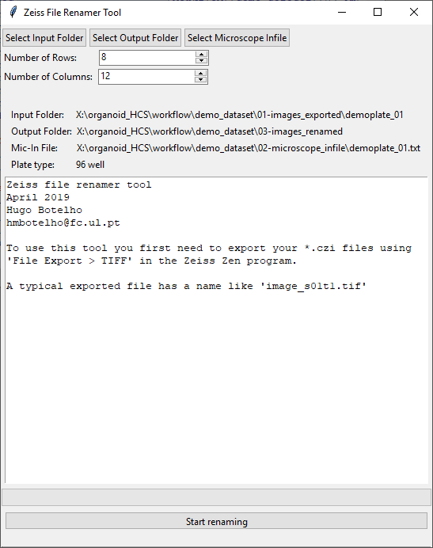
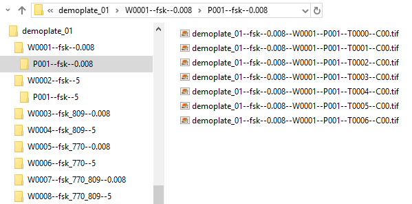
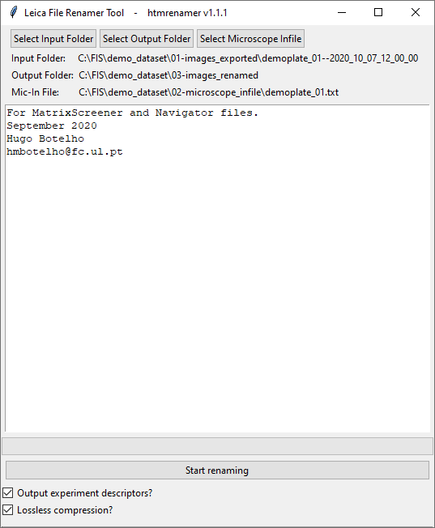

# htmrenamer
*Systematic renaming of high throughput microscopy images*

High throughput microscopy systems output raw image files with systematic names typically indicating the plate name, well identity, time number, z slice number and other relevant metadata. The file name structure depends on the manufacturer:

* **Zeiss:** `demoplate_01_s01t1.tif`
* **Leica (MatrixScreener):** `I--L0000--S00--U00--V00--J08--E00--O00--X00--Y00--T0000--Z00--C00.ome.tif`
* **...**

The htmrenamer r package provides graphical and command line tools for renaming such files in order to generate a common file and folder structure, regardless of the system generating the images. The renaming process adds essential experimental metadata in the file and folder names:
* Plate name
* Well number
* Sub-position within the well
* Time number
* Fluorescence channel sequence
* Experimental treatment 1 (*e.g.* compound)
* Experimental treatment 2 (*e.g.* compound concentration)
    
htmrenamer produces file and folder structures such as the one depicted below or on the [sample data folder](/sample_data).

```
plate_folder
          ┣ Well 1
          ┃      ┣ Position 1
          ┃      ┃          ┣ platename--compound--concentration--W0001--P002--T0000--Z000--C00.ome.tif
          ┃      ┃          ┣ platename--compound--concentration--W0001--P002--T0000--Z000--C01.ome.tif
          ┃      ┃          ...
          ┃      ┣ Position 1
          ┃      ┣ Position 2
          ┃      ...
          ┣ Well 2
          ...
```

By adapting manufacturer-specific file names into a common structure, htmrenamer facilitates manual image inspection, regular expression-based data annotation (*e.g.* using [CellProfiler](https://cellprofiler.org/)) and enables downstream image analysis protocols to be readily performed regardless of the brand of the microscope generating the images. htmrenamer is best used as a complement to the [OME-TIFF](https://docs.openmicroscopy.org/ome-model/5.6.3/ome-tiff/) format.

The [htmrenamer manual](https://github.com/hmbotelho/htmrenamer/blob/master/htmrenamer.pdf) documents all functions in the package.


# Workflow
* [1. Installation](#installation)
* [2. Generating well descriptors](#descriptors)
* [3. File renaming](#renaming)
    * [3.1. Zeiss](#renaming-zeiss)
    * [3.2. Leica](#renaming-leica)
* [4. Conventions](#moreinfo)
* [5. Troubleshooting](#troubleshooting)


# <a name="installation">1. Installation</a>

The installation procedure makes the htmrenamer package available on your computer. This is only required when using the package for the first time.
Make sure to download the software matching your computer's operating system (Windows, macOS) and system architecture (32 bit, 64 bit).

1. **Install Java:** [download](https://www.oracle.com/technetwork/java/javase/downloads/) and install the Oracle JDK.


2. **Install XQuartz:** macOS users will need to [download](https://www.xquartz.org/) and install XQuartz in order to use the graphical user interface implemented in the `rename_leica_gui()` and `rename_zeiss_gui()` functions.


3. **Install R:** Download R from the [CRAN website](https://cran.r-project.org/). Then, install and run it.


4. **Install the htmrenamer package:** use the R command line to install the [devtools](https://github.com/r-lib/devtools) package by typing

```
install.packages("devtools")
library(devtools)
install_github("hmbotelho/htmrenamer")
```

Hit enter/return after each line to execute the command.


# <a name="descriptors">2. Generating well descriptors</a>

Renaming of raw microscopy images requires that the experimental treatment of each well are described in a plain text microscope “infile”. Common treatments are:

* Compound & concentration
* siRNA reference & target gene
* Cell line & experimental insult
* ...

The microscope infile has a table-like structure:

```
001--A--01--00--00--fsk--0.008
002--A--02--01--00--fsk--5
003--A--03--02--00--fsk_vx809--0.008
004--A--04--03--00--fsk_vx809--5
005--A--05--04--00--fsk_vx770--0.008
006--A--06--05--00--fsk_vx770--5
```

Columns are separated by a double dash (`--`) and represent:

* **Well Number** (`001`, `002`, `003`, ...)
* **Row Coordinate** (`A`, `B`, `C`, ...)
* **ColumnCoordinate** (`01`, `02`, `03`, ...)
* **ColumnCoordinate** (`00`, `01`, `02`, ...)
* **Row Coordinate** (`00`, `01`, `02`, ...)
* **Experimental condition 1 (*e.g.* compound)** (`fsk`, `fsk_vx809`, ...)
* **Experimental condition 2 (*e.g.* concentration)** (`0.008`, `5`, ...)


To generate a blank infile corresponding to a 96 well plate (8 × 12 wells), type the following commands in the R command line:

```
library("htmrenamer")
newinfile.char(8, 12, show = TRUE, saveto = "myinfile.txt")
```

The infile will be displayed on the R console and saved to the working directory (to know what that is, type `getwd()`). This file can now be edited to describe any given assay plate. The `txt` file extension is recommended.

[This file](https://github.com/hmbotelho/htmrenamer/blob/master/extras/InFile_template.xlsx) simplifies the description of 96 and 384 well plates.


# <a name="renaming">3. File renaming</a>

The file renaming tools take as inputs raw microscopy images and the microscope infile, to generate a common file/folder structure, regardless of the microscope manufacturer. htmrenamer currently supports the renaming of images acquired with Zeiss and Leica high-throughput microscopes.


## <a name="renaming-zeiss">3.1. Zeiss</a>

Images acquired in the CZI format must first be exported as TIF files (in Zen Blue edition: `File > Export/Import > Export > TIFF`).
Sample exported images are available in the [sample data folder](/sample_data/Zeiss/confocal_raw)


1. In the R command line type

```
library(htmrenamer)
rename_zeiss_gui()
```


2. If prompted, select a CRAN mirror to download the required additional libraries.


3. The renaming tool window will appear:




4. Specify the following details of the experiment:
    * **Select input folder:** Folder with exported TIF files.
    * **Select output folder:** Folder where renamed images should be saved to.
    * **Select Microscope Infile:** Location of the infile.
    * **Number of rows:** Number of rows in the assay plate, regardless of how many wells were imaged. [96 well plates: 8][384 well plates: 16].
    * **Number of columns:** Number of columns in the assay plate, regardless of how many wells were imaged. [96 well plates: 12][384 well plates: 24].


5. Click the `Start renaming` button to start the file renaming process.
	**Note 1:** This is a copy-and-duplicate process.
	**Note 2:** The name of the infile `txt` file should be meaningful as this will be propagated to the renamed files and folders.


6. Progress will be shown in the log text box as well as in the R console.


7. The renaming process will create a folder structure which with renamed files like this one:




## <a name="renaming-leica">3.2. Leica</a>

Currently, htmrenamer only supports images generated with Leica MatrixScreener and exported as OME-TIFF.
Sample exported images are available in the [sample data folder](/sample_data/Leica/confocal_raw)


1. In the R command line type

```
library(htmrenamer)
rename_leica_gui()
```


2. If prompted, select a CRAN mirror to download the required additional libraries.


3. The renaming tool window will appear:




4. Specify the following details of the experiment:
    * **Select input folder:** Folder with exported TIF files (typically named `platename--YY_MM_DD_HH_MM_SS`).
    * **Select output folder:** Folder where renamed images should be saved to.
    * **Select Microscope Infile:** Location of the infile.
    * **Output experiment descriptors:** Export experiment metadata in Excel and CSV format.
    * **Lossless compression:** Performs lossless image compression using the “deflate” algorithm. Typically, this produces a file size ~20% lower than LZW-compressed images but removes all metadata (e.g. pixel size calibration).


5. Click the `Start renaming` button to start the file renaming process. This is a copy-and-duplicate process.
	**Note 1:** This is a copy-and-duplicate process.
	**Note 2:** The name of the infile `txt` file should be meaningful as this will be propagated to the renamed files and folders.
	

6. Progress will be shown in the log text box as well as in the R console.


7. The renaming process will create a folder structure which with renamed files like this one:


# <a name="moreinfo">4. Conventions</a>

Wells are numbered sequentially, left-to-right and top-to-bottom. As an example, this is how wells are numbered in a 96 well plate:

|   	|  **1** 	|  **2** 	|  **3** 	|  **4** 	|  **5** 	|  **6** 	|  **7** 	|  **8** 	|  **9** 	| **10** 	| **11** 	| **12** 	|
|:-:	|:--:	|:--:	|:--:	|:--:	|:--:	|:--:	|:--:	|:--:	|:--:	|:--:	|:--:	|:--:	|
| **A** 	|  1 	|  2 	|  3 	|  4 	|  5 	|  6 	|  7 	|  8 	|  9 	| 10 	| 11 	| 12 	|
| **B** 	| 13 	| 14 	| 15 	| 16 	| 17 	| 18 	| 19 	| 20 	| 21 	| 22 	| 23 	| 24 	|
| **C** 	| 25 	| 26 	| 27 	| 28 	| 29 	| 30 	| 31 	| 32 	| 33 	| 34 	| 35 	| 36 	|
| **D** 	| 37 	| 38 	| 39 	| 40 	| 41 	| 42 	| 43 	| 44 	| 45 	| 46 	| 47 	| 48 	|
| **E** 	| 49 	| 50 	| 51 	| 52 	| 53 	| 54 	| 55 	| 56 	| 57 	| 58 	| 59 	| 60 	|
| **F** 	| 61 	| 62 	| 63 	| 64 	| 65 	| 66 	| 67 	| 68 	| 69 	| 70 	| 71 	| 72 	|
| **G** 	| 73 	| 74 	| 75 	| 76 	| 77 	| 78 	| 79 	| 80 	| 81 	| 82 	| 83 	| 84 	|
| **H** 	| 85 	| 86 	| 87 	| 88 	| 89 	| 90 	| 91 	| 92 	| 93 	| 94 	| 95 	| 96 	|


The same convention applies if multiple imaging fields have been acquired inside each well, according to a sub-position matrix. This example shows the numbering of 5×5 imaging fields inside a well:


<table class="tg">
  <tr>
    <td class="tg-pos">P001</td>
    <td class="tg-pos">P002</td>
    <td class="tg-pos">P003</td>
    <td class="tg-pos">P004</td>
    <td class="tg-pos">P005</td>
  </tr>
  <tr>
    <td class="tg-pos">P006</td>
    <td class="tg-pos">P007</td>
    <td class="tg-pos">P008</td>
    <td class="tg-pos">P009</td>
    <td class="tg-pos">P010</td>
  </tr>
  <tr>
    <td class="tg-pos">P011</td>
    <td class="tg-pos">P012</td>
    <td class="tg-pos">P013</td>
    <td class="tg-pos">P014</td>
    <td class="tg-pos">P015</td>
  </tr>
  <tr>
    <td class="tg-pos">P016</td>
    <td class="tg-pos">P017</td>
    <td class="tg-pos">P018</td>
    <td class="tg-pos">P019</td>
    <td class="tg-pos">P020</td>
  </tr>
  <tr>
    <td class="tg-pos">P021</td>
    <td class="tg-pos">P022</td>
    <td class="tg-pos">P023</td>
    <td class="tg-pos">P024</td>
    <td class="tg-pos">P025</td>
  </tr>
</table>


The Leica renaming tool will ignore unused wells and sub-positions, but keep the same numbering as shown before. Here is an example for a well where only some sub-positions have been imaged:


<table class="tg">
  <tr>
    <td class="tg-pos"></td>
    <td class="tg-pos"></td>
    <td class="tg-pos">P003</td>
    <td class="tg-pos"></td>
    <td class="tg-pos"></td>
  </tr>
  <tr>
    <td class="tg-pos"></td>
    <td class="tg-pos">P007</td>
    <td class="tg-pos"></td>
    <td class="tg-pos">P009</td>
    <td class="tg-pos"></td>
  </tr>
  <tr>
    <td class="tg-pos">P011</td>
    <td class="tg-pos"></td>
    <td class="tg-pos">P013</td>
    <td class="tg-pos"></td>
    <td class="tg-pos">P015</td>
  </tr>
  <tr>
    <td class="tg-pos"></td>
    <td class="tg-pos">P017</td>
    <td class="tg-pos"></td>
    <td class="tg-pos">P019</td>
    <td class="tg-pos"></td>
  </tr>
  <tr>
    <td class="tg-pos"></td>
    <td class="tg-pos"></td>
    <td class="tg-pos">P023</td>
    <td class="tg-pos"></td>
    <td class="tg-pos"></td>
  </tr>
</table>


# <a name="troubleshooting">5. Troubleshooting</a>

This section contains fixes for the most common problems one may find when installing or running htmrenamer.


**R freezes (masOS users)**  
If XQuartz is not installed, R will freeze when running the `rename_leica_gui()` or `rename_zeiss_gui()` functions.
XQuartz can be downloaded from [this link](https://www.xquartz.org/).
___


**Packages fail to install**  
If any of the required packages fails to install (error message similar to `Error: package or namespace load failed for ‘packagename’`), remove the problematic package with

```
remove.packages(packagename)
```

and load htmrenamer with

```
library(htmrenamer)
```
___


**Java error**  
If R thows the following (or similar) error message when loading htmrenamer or one of its functions

```
Error: package or namespace load failed for ‘rJava’:
 .onLoad failed in loadNamespace() for 'rJava', details:
  call: dyn.load(file, DLLpath = DLLpath, ...)
  error: unable to load shared object '/Users/yourname/Library/R/3.6/library/rJava/libs/rJava.so':
  dlopen(/Users/yourname/Library/R/3.6/library/rJava/libs/rJava.so, 6): Library not loaded: /Library/Java/JavaVirtualMachines/jdk-11.0.1.jdk/Contents/Home/lib/server/libjvm.dylib
  Referenced from: /Users/yourname/Library/R/3.6/library/rJava/libs/rJava.so
  Reason: image not found
```

it means that there is an incorrect linking of the JDK version installed in your computer and the rJava package, which htmrenamer depends on.

First, make sure that JDK is installed ([download site](https://www.oracle.com/technetwork/java/javase/downloads/)). On **Windows** computers, reinstalling the JDK may be required.

To relink Java correctly on **macOS** computers, open a Terminal window and type:

```
sudo R CMD javareconf
```

This will solve some of the situations. If the error persists, the only known solution is to replace the currently installed JDK by the one mentioned in the error message (version 10.0.1 in the exampe above). Please be aware that older Java versions may have security vulnerabilities.

JDK may be uninstalled by pasting the typing commands on a Terminal window:

*Uninstall Java*
```
sudo rm -fr /Library/Internet\ Plug-Ins/JavaAppletPlugin.plugin 
sudo rm -fr /Library/PreferencePanes/JavaControlPanel.prefPane 
sudo rm -fr ~/Library/Application\ Support/Oracle/Java
```

*Uninstall JDK (replace `<version>` with the JDK version installed on your system)*

```
sudo rm -rf /Library/Java/JavaVirtualMachines/jdk<version>.jdk
```

*Uninstall Java plugins*

```
sudo rm -rf /Library/PreferencePanes/JavaControlPanel.prefPane
sudo rm -rf /Library/Internet\ Plug-Ins/JavaAppletPlugin.plugin
sudo rm -rf /Library/LaunchAgents/com.oracle.java.Java-Updater.plist
sudo rm -rf /Library/PrivilegedHelperTools/com.oracle.java.JavaUpdateHelper
sudo rm -rf /Library/LaunchDaemons/com.oracle.java.Helper-Tool.plist
sudo rm -rf /Library/Preferences/com.oracle.java.Helper-Tool.plist
```

Any given JDK version can be downloaded from the [Oracle Java Archive](https://www.oracle.com/technetwork/java/javase/archive-139210.html). Select and install the one that matches your operating system, system architecture (32/64 bit) and the version mentioned in the error message.

You should now be able to run htmrenamer.
